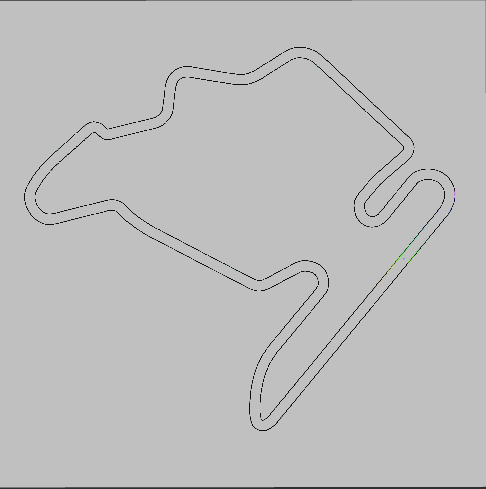
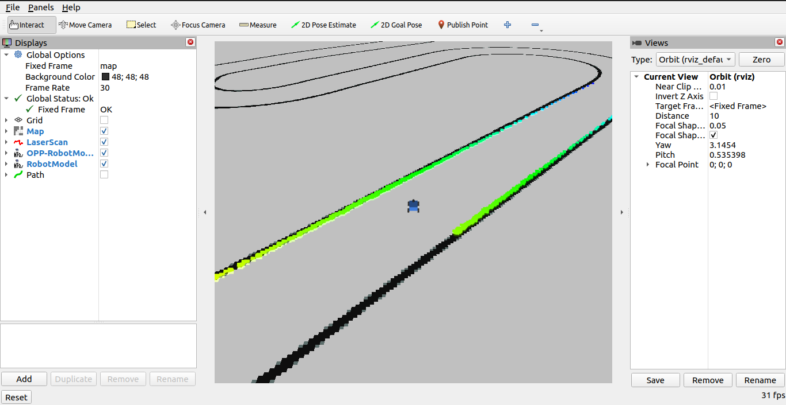
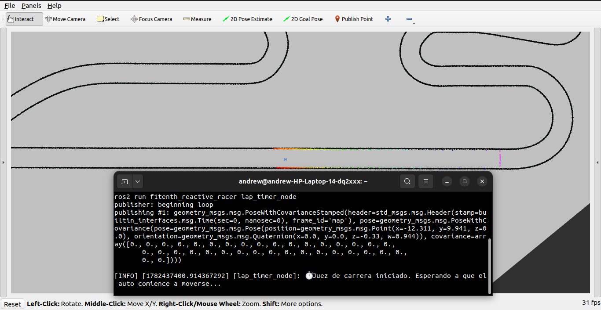
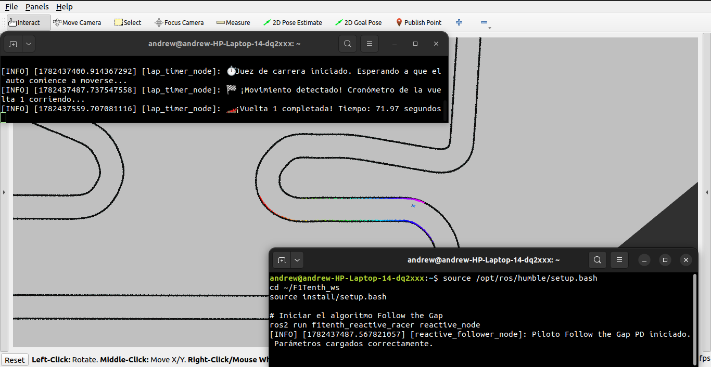
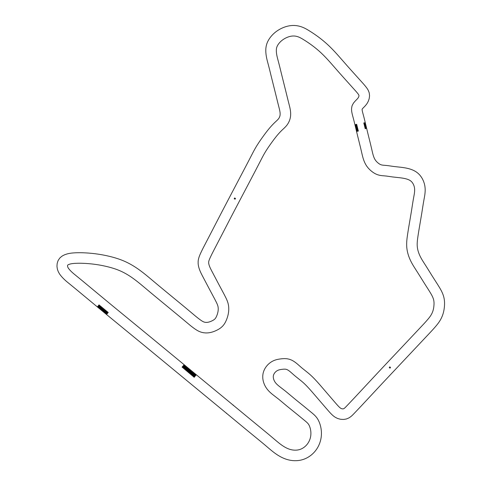
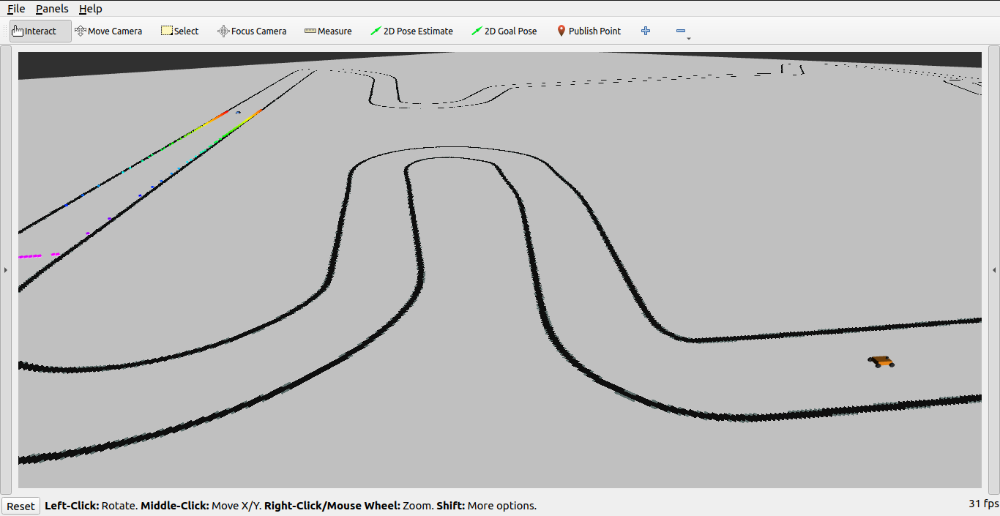

# F1TENTH Reactive Racer - Budapest Track

**Autor:** Andrew Emmanuel Cornejo Ramirez
**Pista de Evaluación:** Budapest.

Este repositorio contiene la implementación de un controlador reactivo para la competencia autónoma F1TENTH en ROS 2. El proyecto se divide en diferentes pruebas de validación, con el objetivo principal de completar 10 vueltas consecutivas sin colisiones en el menor tiempo posible, tanto en pista libre como evadiendo obstáculos estáticos y dinámicos (NPCs).

<div align="center">
  
</div>

---

## 🛑 Prerrequisitos

Para poder ejecutar este proyecto desde cero, es indispensable contar con el siguiente software instalado en una máquina con Ubuntu 22.04:

1. **ROS 2 Humble:** Framework principal de robótica. 
   * [Guía de instalación oficial de ROS 2 Humble](https://docs.ros.org/en/humble/index.html)
2. **Simulador F1TENTH:** Entorno oficial de simulación física.
   * [Repositorio y tutorial de instalación del simulador](https://github.com/widegonz/F1Tenth-Repository)

---

## 📘 Descripción del Enfoque Utilizado

El algoritmo principal utiliza una arquitectura de carreras avanzada con **Percepción Dividida (Split-Perception)** y Control PD Dinámico para lograr una evasión de obstáculos estable. Al ser puramente reactivo, no depende de mapas globales, procesando la toma de decisiones en tiempo real a través de los siguientes pasos:

1. **Limpieza del LiDAR:** Filtra valores infinitos o nulos del escáner láser, limitando la visión útil a un máximo de 30 metros para evitar falsos positivos en rectas largas.
2. **Burbuja de Seguridad:** Detecta el obstáculo inminente más cercano e "infla" su tamaño forzando a cero los rayos láser adyacentes (`bubble_size = 3`), obligando al algoritmo a trazar trayectorias que protegen el chasis del vehículo.
3. **Identificación de Brechas:** Localiza la secuencia más amplia de espacio libre (el "Gap") para determinar la dirección general de escape.
4. **Percepción Dividida (Split-Perception):** El robot separa su atención en dos objetivos distintos:
   * **Visión Periférica (Velocidad y Estabilidad):** Evalúa la amplitud y forma del hueco (Gap) para seleccionar la ruta de evasión más estable, manteniendo el acelerador a fondo y reduciendo la velocidad de forma exponencial solo cuando el objetivo está a menos de 4.4 metros.
   * **Visión Frontal (Dirección):** Un escáner central estrecho (0.40 radianes) vigila exclusivamente la distancia hacia el muro frontal para calcular el momento exacto de giro.
5. **Control PD Dinámico Exponencial:** Utiliza un controlador Proporcional-Derivativo para la dirección. Las ganancias _Kp_ y _Kd_ se mantienen atenuadas en rectas para brindar estabilidad, y se liberan mediante una curva matemática exponencial normalizada solo cuando el muro frontal cruza el umbral crítico, forzando un giro estilo "Late Apex".

---

## 📂 Estructura del Código

El núcleo del proyecto reside en los siguientes scripts dentro del paquete `f1tenth_reactive_racer`:

* `reactive_follower.py`: Nodo principal de ROS 2 que procesa la matriz de distancias y publica comandos de conducción para el vehículo principal. Contiene un **"Panel de Control y Tuning"** en su interior para modificar la agresividad y percepción según el escenario.
* `opp_reactive_follower.py`: Nodo secundario configurado con velocidades reducidas (~20%) e independizado en los tópicos `/opp_scan` y `/opp_drive` para actuar como un obstáculo dinámico o NPC en la pista.
* `lap_timer.py`: Juez de carrera autónomo que certifica las 10 vueltas requeridas. Extrae la marca de tiempo nativa del simulador, autocalibra la línea de meta dinámicamente e implementa un margen de seguridad de 5.0 metros para evitar falsos conteos.

---

## 🚀 Instrucciones de Ejecución (General)

**NOTA IMPORTANTE:** Las siguientes instrucciones asumen el uso de ROS 2 Humble. Es fundamental reemplazar `tu_usuario` y `F1Tenth_ws` en las rutas con los nombres correspondientes a su usuario de Ubuntu y al nombre de su espacio de trabajo.

### 0. Preparación del Espacio de Trabajo
Si no cuenta con el controlador descargado, abra una terminal y clone el repositorio en su espacio de trabajo de F1TENTH:

```bash
source /opt/ros/humble/setup.bash
mkdir -p ~/F1Tenth_ws/src
cd ~/F1Tenth_ws/src
git clone https://github.com/aecornej/f1tenth_reactive_racer.git
```

Luego, instale las dependencias necesarias:

```bash
cd ~/F1Tenth_ws
sudo apt update
rosdep update
rosdep install -i --from-path src --rosdistro humble -y
```

### 1. Copiar los Mapas al Simulador
Copie los mapas de Budapest (estándar y con obstáculos) hacia la carpeta oficial del simulador:

```bash
cp ~/F1Tenth_ws/src/f1tenth_reactive_racer/maps/Budapest_map* ~/F1Tenth_ws/src/f1tenth_gym_ros/maps/
```

---

## 🏁 Pruebas de Competencia

Para cada una de las siguientes pruebas, asegúrese de editar primero el archivo `sim.yaml` del simulador y el archivo `reactive_follower.py` de este paquete según las indicaciones proporcionadas para cada escenario.

### Escenario 1: Pista Libre (10 Vueltas)

**Configuración:**
1. Abra `nano ~/F1Tenth_ws/src/f1tenth_gym_ros/config/sim.yaml` y asegúrese de que el mapa sea el estándar:

```bash
map_path: '/home/tu_usuario/F1Tenth_ws/src/f1tenth_gym_ros/maps/Budapest_map'
```
Busca la sección `# map parameters` y modifica la ruta absoluta en `map_path` para que apunte al nuevo mapa
```bash
# map parameters
map_path: '/home/tu_usuario/F1Tenth_ws/src/f1tenth_gym_ros/maps/Budapest_map'
map_img_ext: '.png'
```
Guarda los cambios `Ctrl + O`, `Enter` y cierra el editor `Ctrl + X`.

2. Establecer los parámetros para el escenario 1:
Abra el archivo del controlador principal
```bash
gedit ~/F1Tenth_ws/src/f1tenth_reactive_racer/f1tenth_reactive_racer/reactive_follower.py
```
pegue y guarde estos parámetros en el **Panel de Control** (lineas 14 al 41):

```python
        # ==========================================
        # ⚙️ PANEL DE CONTROL Y TUNING
        # ==========================================
        
        # --- 1. PARÁMETROS DE PERCEPCIÓN GEOMÉTRICA ---
        self.view_angle = 1.3           
        self.frontal_view_angle = 0.4    # Cono frontal estrecho para medir muros inminentes sin asustarse con las paredes laterales
        self.max_lidar_range = 30.0

        # --- 2. PARÁMETROS DEL DISPARITY EXTENDER Y SEGURIDAD ---
        self.car_radius = 0.5           # Radio físico + margen (0.35m evita roces protegiendo los pasillos estrechos del Escenario 2)
        self.disparity_threshold = 0.4  # Detecta bordes abruptos (ideal para el salto de 0.5m a 2.3m del Escenario 3)
        self.failsafe_dist = 0.42        # Distancia de emergencia si la visión falla

        # --- 3. PARÁMETROS DE VELOCIDAD ---
        self.max_speed = 9.5
        self.min_speed = 1.1
        self.braking_distance_vel = 5.8  # Empieza a frenar a 6 metros de la curva

        # --- 4. PARÁMETROS DE DIRECCIÓN (CONTROL PD) ---
        self.braking_distance_kp = 2.0
        self.Kp = 1.7
        self.k_vel = 1.8
        self.k_kp = 0.4
        self.Kd = 0.1
        self.steering_attenuation = 0.48         # Atenuación del Kp en rectas
        self.max_steering_angle = 0.6	         # Máx 1.066 radianes
	         
```

**Ejecución:**
1. **Terminal 1 (Compilar y Lanzar Simulador):**

```bash
source /opt/ros/humble/setup.bash
cd ~/F1Tenth_ws
colcon build
source install/setup.bash
ros2 launch f1tenth_gym_ros gym_bridge_launch.py
```

2. **Terminal 2 (Juez):**

```bash
source /opt/ros/humble/setup.bash
cd ~/F1Tenth_ws
source install/setup.bash
ros2 topic pub --once /initialpose geometry_msgs/msg/PoseWithCovarianceStamped "{header: {frame_id: 'map'}, pose: {pose: {position: {x: -12.311, y: 9.941, z: 0.0}, orientation: {x: 0.0, y: 0.0, z: -0.330, w: 0.944}}}}"
ros2 run f1tenth_reactive_racer lap_timer_node
```

3. **Terminal 3 (Controlador):**

```bash
source /opt/ros/humble/setup.bash
cd ~/F1Tenth_ws
source install/setup.bash
ros2 run f1tenth_reactive_racer reactive_node
```


> 🎥 **Video Demostrativo:** https://youtu.be/1JDJKouoiZk

---

### Escenario 2: Pista con 5 Obstáculos Estáticos

<div align="center">
  
</div>

**Configuración:**
1. Abra `sim.yaml` y cambie el mapa al que contiene obstáculos:

```bash
    # map parameters
    map_path: '/home/andrew/F1Tenth_ws/src/f1tenth_gym_ros/maps/Budapest_map_obst'
    map_img_ext: '.png'
```

2. Abra `reactive_follower.py` y actualice los parámetros para mayor agilidad:

```python
        # ==========================================
        # ⚙️ PANEL DE CONTROL Y TUNING
        # ==========================================
        
        # --- 1. PARÁMETROS DE PERCEPCIÓN GEOMÉTRICA ---
        self.view_angle = 1.3           
        self.frontal_view_angle = 0.4    # Cono frontal estrecho para medir muros inminentes sin asustarse con las paredes laterales
        self.max_lidar_range = 30.0

        # --- 2. PARÁMETROS DEL DISPARITY EXTENDER Y SEGURIDAD ---
        self.car_radius = 0.42           # Radio físico + margen (0.35m evita roces protegiendo los pasillos estrechos del Escenario 2)
        self.disparity_threshold = 0.4  # Detecta bordes abruptos (ideal para el salto de 0.5m a 2.3m del Escenario 3)
        self.failsafe_dist = 0.42        # Distancia de emergencia si la visión falla

        # --- 3. PARÁMETROS DE VELOCIDAD ---
        self.max_speed = 8.4
        self.min_speed = 1.2
        self.braking_distance_vel = 6.0  # Empieza a frenar a 6 metros de la curva

        # --- 4. PARÁMETROS DE DIRECCIÓN (CONTROL PD) ---
        self.braking_distance_kp = 2.0
        self.Kp = 1.5
        self.k_vel = 1.9
        self.k_kp = 0.2
        self.Kd = 0.1
        self.steering_attenuation = 0.48         # Atenuación del Kp en rectas
        self.max_steering_angle = 0.4	         # Máx 1.066 radianes
	         
```

**Ejecución:**
1. **Terminal 1 (Compilar y Lanzar Simulador):**

```bash
source /opt/ros/humble/setup.bash
cd ~/F1Tenth_ws
colcon build
source install/setup.bash
ros2 launch f1tenth_gym_ros gym_bridge_launch.py
```

2. **Terminal 2 (Juez):**

```bash
source /opt/ros/humble/setup.bash
cd ~/F1Tenth_ws
source install/setup.bash
ros2 topic pub --once /initialpose geometry_msgs/msg/PoseWithCovarianceStamped "{header: {frame_id: 'map'}, pose: {pose: {position: {x: -12.311, y: 9.941, z: 0.0}, orientation: {x: 0.0, y: 0.0, z: -0.330, w: 0.944}}}}"
ros2 run f1tenth_reactive_racer lap_timer_node
```

3. **Terminal 3 (Controlador):**

```bash
source /opt/ros/humble/setup.bash
cd ~/F1Tenth_ws
source install/setup.bash
ros2 run f1tenth_reactive_racer reactive_node
```
> 🎥 **Video Demostrativo:** https://youtu.be/ZlIY-YIXxtc

---

### Escenario 3: Pista con 2 Obstáculos Dinámicos (NPCs)

<div align="center">
  
</div>

**Configuración:**
1. Abra `sim.yaml`, use la pista de su preferencia y asegúrese de habilitar los vehículos oponentes, al igual que su posición inicial en la configuración del simulador oficial.
```bash
    # map parameters
    map_path: '/home/andrew/F1Tenth_ws/src/f1tenth_gym_ros/maps/Budapest_map'
    map_img_ext: '.png'

    # opponent parameters
    num_agent: 2

    # ego starting pose on map
    sx: 0.0
    sy: 0.0
    stheta: 0.0

    # opp starting pose on map
    sx1: 33.5
    sy1: 1.85
    stheta1: 0.78

```
2. Abra `reactive_follower.py` y aplique los parámetros de máxima respuesta:

```python
        # ==========================================
        # ⚙️ PANEL DE CONTROL Y TUNING
        # ==========================================
        
        # --- 1. PARÁMETROS DE PERCEPCIÓN GEOMÉTRICA ---
        self.view_angle = 1.3           
        self.frontal_view_angle = 0.4    # Cono frontal estrecho para medir muros inminentes sin asustarse con las paredes laterales
        self.max_lidar_range = 30.0

        # --- 2. PARÁMETROS DEL DISPARITY EXTENDER Y SEGURIDAD ---
        self.car_radius = 0.42           # Radio físico + margen (0.35m evita roces protegiendo los pasillos estrechos del Escenario 2)
        self.disparity_threshold = 0.4  # Detecta bordes abruptos (ideal para el salto de 0.5m a 2.3m del Escenario 3)
        self.failsafe_dist = 0.42        # Distancia de emergencia si la visión falla

        # --- 3. PARÁMETROS DE VELOCIDAD ---
        self.max_speed = 8.4
        self.min_speed = 1.2
        self.braking_distance_vel = 6.0  # Empieza a frenar a 6 metros de la curva

        # --- 4. PARÁMETROS DE DIRECCIÓN (CONTROL PD) ---
        self.braking_distance_kp = 2.0
        self.Kp = 1.5
        self.k_vel = 2.2
        self.k_kp = 0.4
        self.Kd = 0.1
        self.steering_attenuation = 0.48         # Atenuación del Kp en rectas
        self.max_steering_angle = 0.4	         # Máx 1.066 radianes
         
```

**Ejecución:**
1. **Terminal 1 (Compilar y Lanzar Simulador):**

```bash
source /opt/ros/humble/setup.bash
cd ~/F1Tenth_ws
colcon build
source install/setup.bash
ros2 launch f1tenth_gym_ros gym_bridge_launch.py
```

2. **Terminal 2 (Juez):**
```bash
source /opt/ros/humble/setup.bash
cd ~/F1Tenth_ws
source install/setup.bash
ros2 topic pub --once /initialpose geometry_msgs/msg/PoseWithCovarianceStamped "{header: {frame_id: 'map'}, pose: {pose: {position: {x: -12.311, y: 9.941, z: 0.0}, orientation: {x: 0.0, y: 0.0, z: -0.330, w: 0.944}}}}"
ros2 run f1tenth_reactive_racer lap_timer_node
```

3. **Terminal 3 (NPCs Oponentes):**
```bash
source /opt/ros/humble/setup.bash
cd ~/F1Tenth_ws
source install/setup.bash
ros2 run f1tenth_reactive_racer opp_reactive_node
```

4. **Terminal 4 (Controlador Principal):**

```bash
source /opt/ros/humble/setup.bash
cd ~/F1Tenth_ws
source install/setup.bash
ros2 run f1tenth_reactive_racer reactive_node
```

> 🎥 **Video Demostrativo:** https://youtu.be/V0E-o34HTgM
